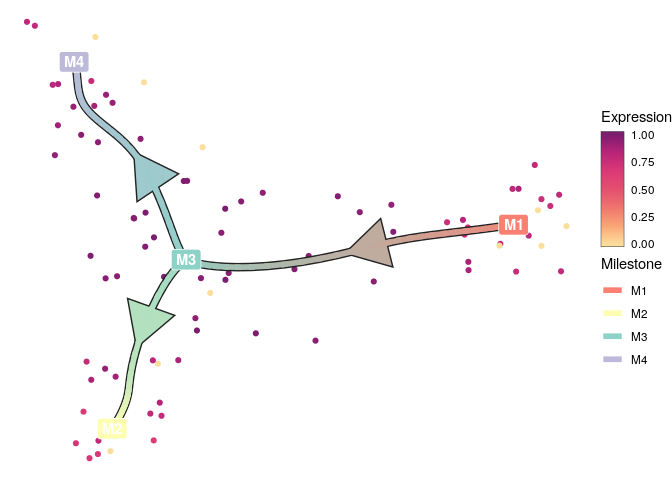

<!-- README.md is generated from README.Rmd. Please edit that file -->

<a href="https://travis-ci.org/dynverse/dynplo2"></a>
<a href="https://codecov.io/gh/dynverse/dynplo2">
</a>
[**ℹ️ Tutorials**](https://dynverse.org)     [**ℹ️ Reference
documentation**](https://dynverse.org/reference/dynplo2)
<br>

# Common visualisation tools for single-cell trajectories

## Installation

``` r
devtools::install_github("dynverse/dynplot2")
```

On linux, udunits2 has to be installed:

  - Debian / Ubuntu / Linux mint: `sudo apt-get install libudunits2-dev`
  - Fedora / CentOS: `sudo dnf install udunits2-devel`

## Usage

The package provides different ways to plot both the topology and
cellular properties of a trajectory:

``` r
dynplot_dimred(dataset) +
  geom_cell_point(aes(colour = select_feature_expression("G1", d = .data))) +
  scale_expression_color() + # a scale has to be given here, otherwise error
  new_scale_color() +
  geom_trajectory_segments(aes(colour = milestone_percentages), size = 2) +
  geom_milestone_label(aes(fill = milestone_id)) +
  scale_milestones_color() +
  scale_milestones_fill()
```

<!-- -->

``` r
# dynplot_dimred(dataset) +
#   geom_cell_point(color = "grey80") +
#   geom_trajectory_segments(aes(colour = milestone_percentages), size = 2) +
#   geom_milestone_label(aes(fill = milestone_id)) +
#   scale_milestones_fill() +
#   scale_milestones_colour() +
#   geom_velocity_arrow(stat = stat_velocity_grid(grid_n = 20))
```

``` r
dynplot_graph(dataset) +
  geom_trajectory_divergence() +
  geom_trajectory_segments(size = 2, color = "#333333", arrow_size = 0.5) +
  geom_cell_point(aes(colour = milestone_percentages)) +
  geom_milestone_label(aes(fill = milestone_id)) +
  scale_milestones_fill() +
  scale_milestones_color()
```

<!-- -->

``` r
dynplot_onedim(dataset, equal_cell_width = TRUE, margin = 0.05) +
  geom_trajectory_segments(aes(color = milestone_percentages), size = 5, color = "#333333") +
  geom_trajectory_connection() +
  scale_milestones_colour() +
  new_scale_colour() +
  geom_cell_point(aes(colour = select_feature_expression("G2", d = .data))) +
  scale_expression_colour() +
  new_scale_colour() +
  geom_milestone_label(aes(y = -0.1, fill = milestone_id, hjust = as.integer(type == "end"))) +
  scale_milestones_fill()
```

<!-- -->

``` r
dynplot_dendro(dataset) +
  geom_trajectory_segments(aes(color = milestone_percentages), size = 5, color = "#333333") +
  geom_trajectory_connection() +
  scale_milestones_colour() +
  new_scale_colour() +
  geom_cell_point(aes(colour = select_feature_expression("G1", d = .data))) +
  scale_expression_colour() +
  new_scale_colour() +
  # geom_cell_point(aes(colour = milestone_percentages)) +
  geom_milestone_label(aes(fill = milestone_id)) +
  scale_milestones_fill()
```

<!-- -->

``` r
dynplot_dendro(dataset) +
  geom_trajectory_segments(aes(color = milestone_percentages), size = 5, color = "#333333") +
  geom_trajectory_connection() +
  scale_milestones_colour() +
  new_scale_colour() +
  geom_cell_point(aes(y = y + dynutils::scale_minmax(select_feature_expression("G2", d=.data)) * 0.5 - 0.25, colour = select_feature_expression("G2", d = .data))) +
  scale_expression_colour() +
  new_scale_colour() +
  # geom_cell_point(aes(colour = milestone_percentages)) +
  geom_milestone_label(aes(fill = milestone_id)) +
  scale_milestones_fill()
```

<!-- -->

``` r
# cell_layout <- layout_onedim(dataset)
# feature_modules <- get_features(dataset)
# feature_layout <- layout_modules(dataset, feature_modules = feature_modules, cell_layout = cell_layout)
# layout <- layout_heatmap(dataset, feature_layout = feature_layout)
# 
# dynplot(dataset, layout = layout) +
#   geom_trajectory_segments(aes(color = milestone_percentages)) +
#   geom_trajectory_connection() +
#   geom_milestone_label(aes(fill = milestone_id, hjust = as.integer(type == "end"))) +
#   scale_milestones_fillcolour() +
#   new_scale_fillcolour() +
#   geom_expression_raster() +
#   scale_expression_fillcolour() +
#   new_scale_fillcolour() +
#   geom_tile(aes(x = x, y = 1))
```

## Latest changes

Check out `news(package = "dynplot2")` or [NEWS.md](NEWS.md) for a full
list of changes.

<!-- This section gets automatically generated from NEWS.md -->

### Recent changes in dynplot2 1.0.0 (unreleased)

  - Spin-off from dynplot, dynplot2 provides a more modular interface to
    visualize trajectories

### Recent changes in dynplot 1.0.0 (28-03-2019)

  - Initial release of dynplot
  - Plotting of trajectories
  - Compatible with all methods of
dynmethods

## Dynverse dependencies

<!-- Generated by "update_dependency_graphs.R" in the main dynverse repo -->


