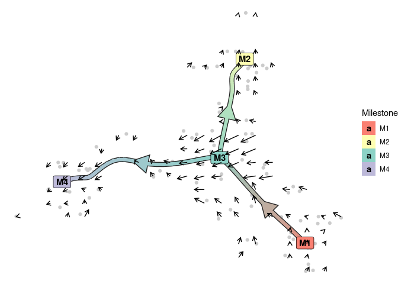
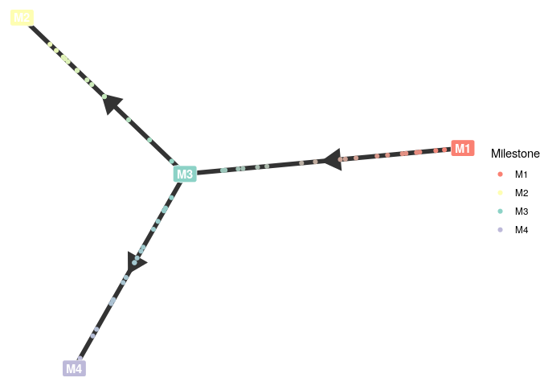
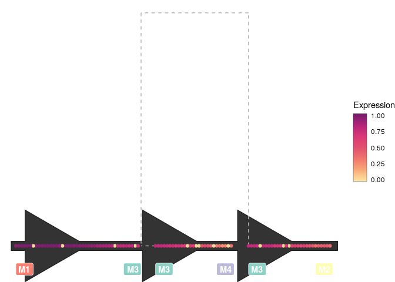
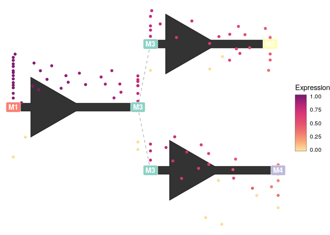
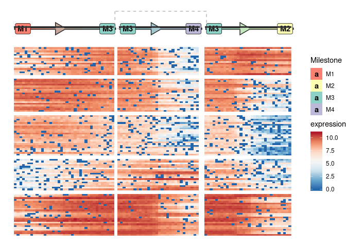
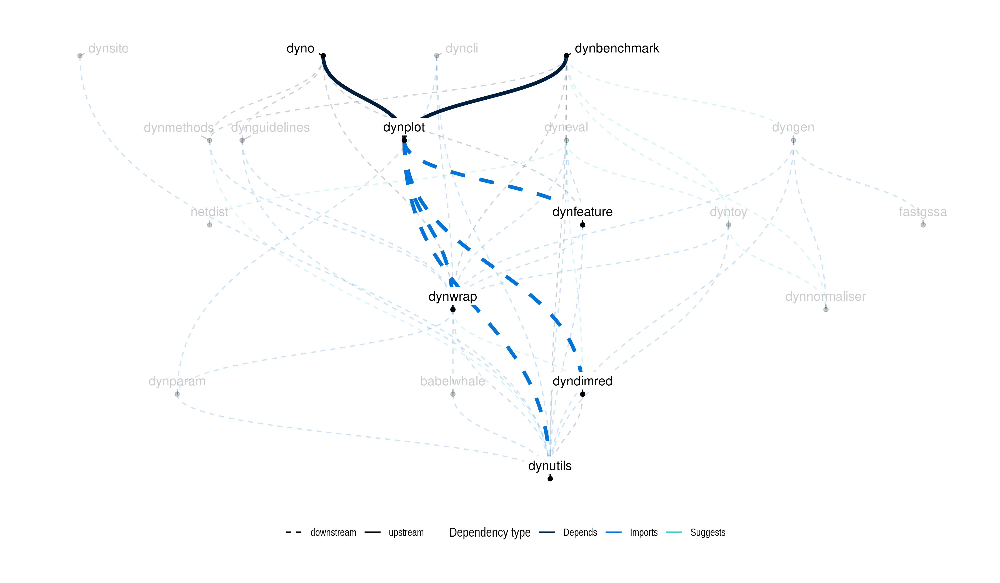

<!-- README.md is generated from README.Rmd. Please edit that file -->

<a href="https://travis-ci.org/dynverse/dynplot"></a>
<a href="https://codecov.io/gh/dynverse/dynplot">
</a>
[**ℹ️ Tutorials**](https://dynverse.org)     [**ℹ️ Reference
documentation**](https://dynverse.org/reference/dynplot)
<br>

# Common visualisation tools for single-cell trajectories

## Installation

``` r
devtools::install_github("dynverse/dynplot")
```

On linux, udunits2 has to be installed:

  - Debian / Ubuntu / Linux mint: `sudo apt-get install libudunits2-dev`
  - Fedora / CentOS: `sudo dnf install udunits2-devel`

## Usage

The package provides different ways to plot both the topology and
cellular properties of a trajectory:

``` r
dynplot(dataset) +
  geom_cell_point(aes(colour = select_expression("G1"))) +
  scale_expression_fillcolour() + # a scale has to be given here, otherwise error
  new_scale_fillcolour() +
  geom_trajectory_segments(aes(colour = milestone_percentages), size = 2) +
  geom_milestone_label(aes(fill = milestone_id)) +
  scale_milestones_fillcolour()
```

<!-- -->

``` r
dynplot(dataset) +
  geom_cell_point(color = "grey80") +
  new_scale_fillcolour() +
  geom_trajectory_segments(aes(colour = milestone_percentages), size = 2) +
  geom_milestone_label(aes(fill = milestone_id)) +
  scale_milestones_fillcolour() +
  geom_velocity_arrow(stat = stat_velocity_grid(grid_n = 20))
```

<!-- -->

``` r
dynplot(dataset, layout = layout_graph(dataset)) +
  geom_trajectory_divergence() +
  geom_trajectory_segments(size = 3, color = "#333333") +
  new_scale_fillcolour() +
  geom_cell_point(aes(colour = milestone_percentages)) +
  geom_milestone_label(aes(fill = milestone_id)) +
  scale_milestones_fillcolour()
```

<!-- -->

``` r
dynplot(dataset, layout = layout_onedim(dataset, equal_cell_width = TRUE, margin = 0.05)) +
  geom_trajectory_segments(aes(color = milestone_percentages), size = 5, color = "#333333") +
  geom_trajectory_connection() +
  scale_milestones_fillcolour() +
  new_scale_fillcolour() +
  geom_cell_point(aes(colour = select_expression("G2"))) +
  scale_expression_fillcolour() +
  new_scale_fillcolour() +
  # geom_cell_point(aes(colour = milestone_percentages)) +
  geom_milestone_label(aes(y = -0.1, fill = milestone_id, hjust = as.integer(type == "end"))) +
  scale_milestones_fillcolour()
```

<!-- -->

``` r
dynplot(dataset, layout = layout_dendro(dataset)) +
  geom_trajectory_segments(aes(color = milestone_percentages), size = 5, color = "#333333") +
  geom_trajectory_connection() +
  scale_milestones_fillcolour() +
  new_scale_fillcolour() +
  geom_cell_point(aes(colour = select_expression("G1"))) +
  scale_expression_fillcolour() +
  new_scale_fillcolour() +
  # geom_cell_point(aes(colour = milestone_percentages)) +
  geom_milestone_label(aes(fill = milestone_id)) +
  scale_milestones_fillcolour()
```

<!-- -->

``` r
dynplot(dataset, layout = layout_dendro(dataset)) +
  geom_trajectory_segments(aes(color = milestone_percentages), size = 5, color = "#333333") +
  geom_trajectory_connection() +
  scale_milestones_fillcolour() +
  new_scale_fillcolour() +
  geom_cell_point(aes(y = y + dynutils::scale_minmax(select_expression("G2")) * 0.5 - 0.25, colour = select_expression("G2"))) +
  scale_expression_fillcolour() +
  new_scale_fillcolour() +
  # geom_cell_point(aes(colour = milestone_percentages)) +
  geom_milestone_label(aes(fill = milestone_id)) +
  scale_milestones_fillcolour()
```

<!-- -->

``` r
cell_layout <- layout_onedim(dataset)
feature_modules <- get_features(dataset)
feature_layout <- layout_modules(dataset, feature_modules = feature_modules, cell_layout = cell_layout)
layout <- layout_heatmap(dataset, feature_layout = feature_layout)

dynplot(dataset, layout = layout) +
  geom_trajectory_segments(aes(color = milestone_percentages)) +
  geom_trajectory_connection() +
  geom_milestone_label(aes(fill = milestone_id, hjust = as.integer(type == "end"))) +
  scale_milestones_fillcolour() +
  new_scale_fillcolour() +
  geom_expression_raster() +
  scale_expression_fillcolour() +
  new_scale_fillcolour() +
  geom_tile(aes(x = x, y = 1))
```

<!-- -->

## Latest changes

Check out `news(package = "dynwrap")` or [NEWS.md](inst/NEWS.md) for a
full list of
changes.

<!-- This section gets automatically generated from inst/NEWS.md, and also generates inst/NEWS -->

### Recent changes in dynplot 1.0.0 (28-03-2019)

  - Initial release of dynplot
  - Plotting of trajectories
  - Compatible with all methods of
dynmethods

## Dynverse dependencies

<!-- Generated by "update_dependency_graphs.R" in the main dynverse repo -->


